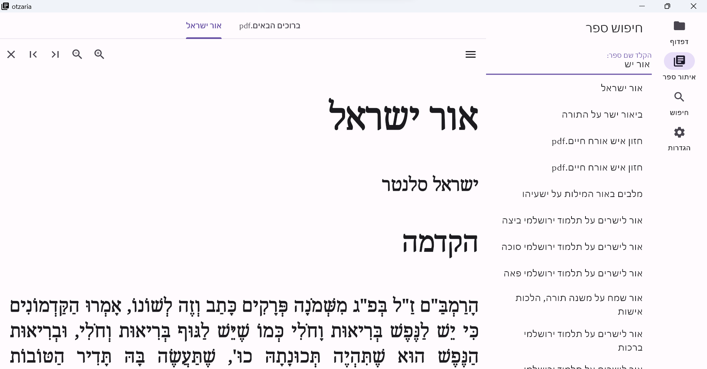
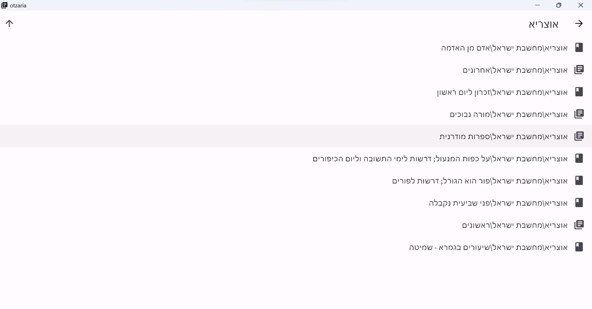

# otzaria

An open source project to bring the sefaria library into PC. The program is written in flutter, so it should be able to run on any platform.

# אוצריא

.פרוייקט בקוד פתוח, להנגשת ספריה תורנית על בסיס המאגר של ספריא.

 הפרוייקט בפיתוח, ויתכנו באגים או אי ריצה.

## הדגמה

## Credits

