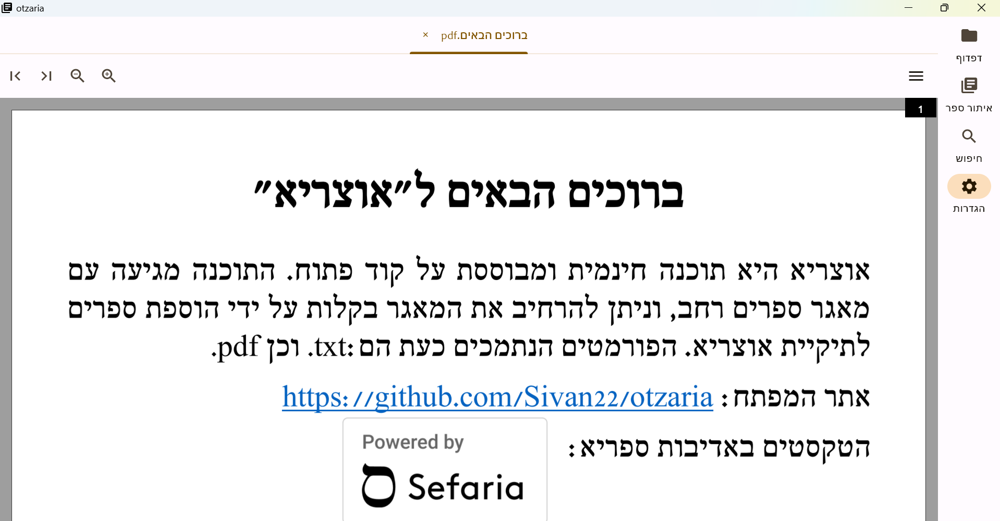
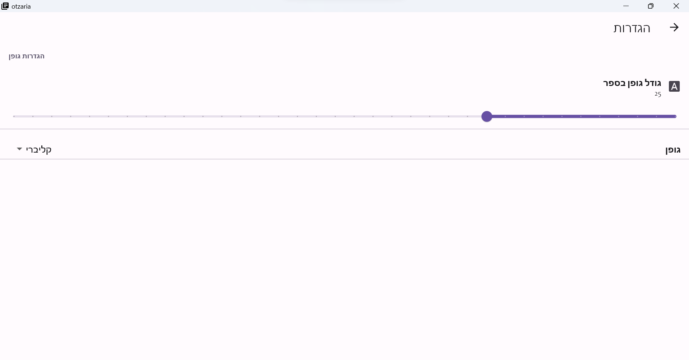
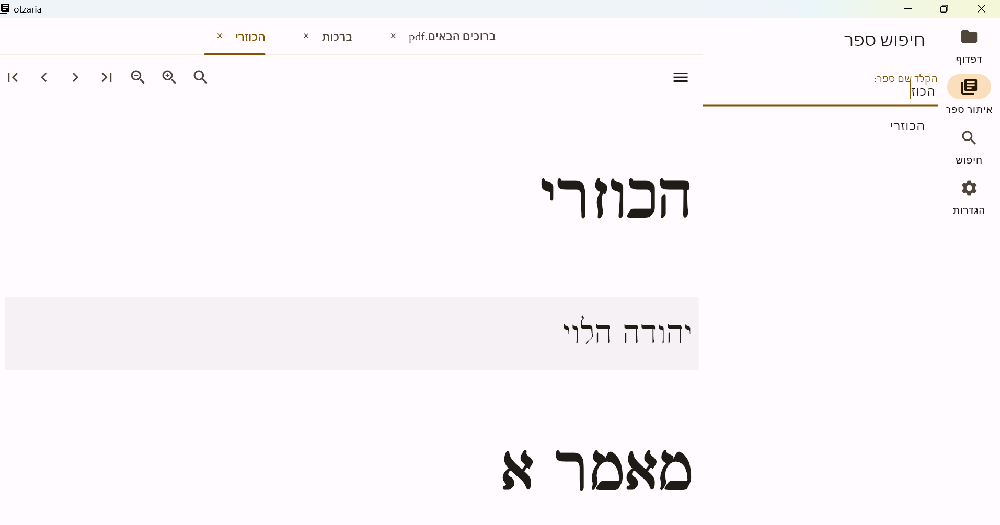
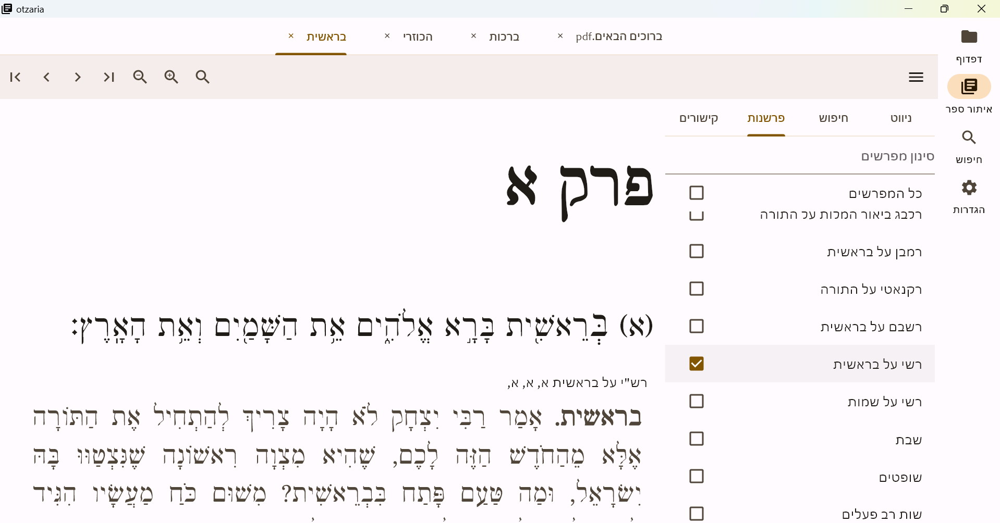
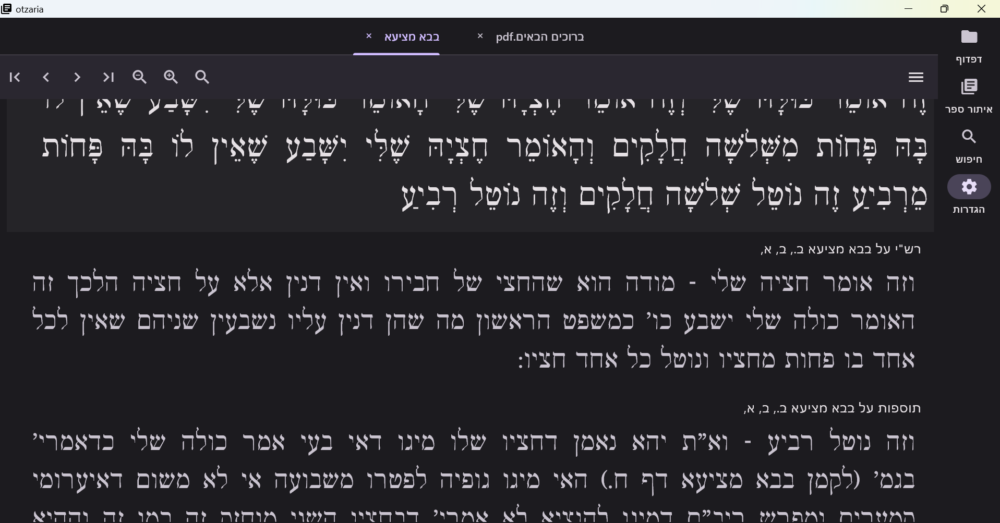
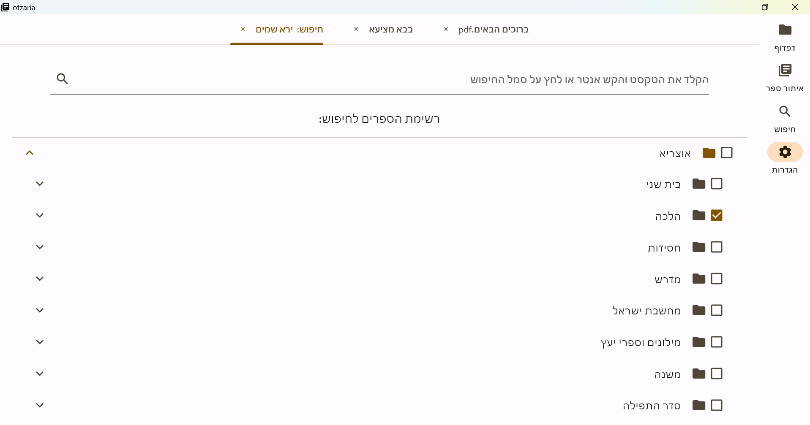

# otzaria

An open source project to bring the sefaria library to PC. The program is written in flutter, and we provide builds for windows, linux and android.

# אוצריא

כנסו (לאתר שלנו)[https://sivan22.github.io/otzaria-download/]

.פרוייקט בקוד פתוח, להנגשת ספריה תורנית על בסיס המאגר של ספריא.

הפרוייקט בפיתוח, ויתכנו באגים או אי ריצה.

## הדגמה

## Credits

vy

