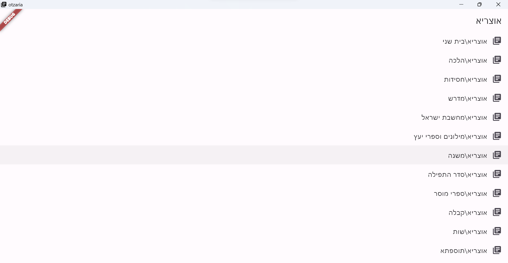

<!-- PROJECT SHIELDS -->
<!--
*** I'm using markdown "reference style" links for readability.
*** Reference links are enclosed in brackets [ ] instead of parentheses ( ).
*** See the bottom of this document for the declaration of the reference variables
*** for contributors-url, forks-url, etc. This is an optional, concise syntax you may use.
*** https://www.markdownguide.org/basic-syntax/#reference-style-links
-->
[![Contributors][contributors-shield]][contributors-url]
[![Forks][forks-shield]][forks-url]
[![Stargazers][stars-shield]][stars-url]
[![Issues][issues-shield]][issues-url]
[![MIT License][license-shield]][license-url]

<!-- PROJECT LOGO -->
 

  

  <h3 align="center">Otzaria</h3>

  

    Making the jewish library accessible to everyone by creating an app with a modern UI/UX, that could run on any device
     
    <a href="https://sivan22.github.io/otzaria-download/"><strong>See our site »</strong></a>
     
       
    <a href="https://github.com/sivan22/otzaria/issues/new?labels=bug&template=bug-report---.md">Report Bug</a>
    ·
    <a href="https://github.com/sivan22/otzaria/issues/new?labels=enhancement&template=feature-request---.md">Request Feature</a>
  

<!-- TABLE OF CONTENTS -->

  
Table of Contents

  <ol>
    <li>
      <a href="#about-the-project">About The Project</a>
      <ul>
        <li><a href="#built-with">Built With</a></li>
      </ul>
    </li>
    <li>
      <a href="#getting-started">Getting Started</a>
      <ul>
        <li><a href="#prerequisites">Prerequisites</a></li>
        <li><a href="#installation">Installation</a></li>
      </ul>
    </li>
    <li><a href="#usage">Usage</a></li>
    <li><a href="#roadmap">Roadmap</a></li>
    <li><a href="#contributing">Contributing</a></li>
    <li><a href="#license">License</a></li>
    <li><a href="#contact">Contact</a></li>
    <li><a href="#acknowledgments">Acknowledgments</a></li>
  </ol>

<!-- ABOUT THE PROJECT -->
## About The Project

I felt the lack of an open source app of the jewish library, for PCs.

Torat Ememt is old and no longer maintained, and Sefaria's app is great, however, it does not work well on computers.

So i decided to make one myself. I did not know Dart and Flutter at all in the beginning, but it was fun. I **love** to learn new technologies!

The database itself is accessible to everyone following the important work of the Sefaria organization, so a big thank to them for that.

Key features of the project:
* the software is FREE and will be ALLWAYS FREE.
* Built to work effeciently on any device, including Windows, Linux, and Android.
* The app is designed to be as user friendly as possible.
* A thorough selection process has been undertaken to ensure that the books are suitable for the Torah community
* the library is flexible, means that you can add or remove books from the library.
* the app supports the following formats: TXT, Docx and PDF.

I hope that my work will help the Torah community to learn easiely and effectively anytime and anywhere.

(<a href="#readme-top">back to top</a>)

### Built With

* [![Dart][dart]][Dart-url]
* [![Flutter][Flutter]][Flutter-url]

I Choose to use Dart and Flutter. I think that is the most efficient and most modern way to build a GUI app.

Also, it is a multiplatform framework.

(<a href="#readme-top">back to top</a>)

<!-- GETTING STARTED -->
## Getting Started

the app is still in development. so there is no installation package yet. you can download the zip from the GitHub repo, unzip it, and run the app.

### Prerequisites

#### windows
make sure that Visual C++ Redistributable is installed on your computer. if not download it from [Here](https://learn.microsoft.com/en-us/cpp/windows/latest-supported-vc-redist?view=msvc-170) and install it.

### Installation

#### windows and linux
* download the full zip (including the library) from the releases page, unzip it, and run the app.
* when first running the app, provide the path to the library. the path should be inside the unzipped folder.

#### android

* Download the apk from the releases page, and install it.
* download the library from the releases page, and unzip it on your device.
* when first running the app, provide the path to the library. the path should be inside the unzipped folder.

(<a href="#readme-top">back to top</a>)

<!-- USAGE EXAMPLES -->
## Usage

See the Wiki section for documentation.

(<a href="#readme-top">back to top</a>)

<!-- ROADMAP -->
## Roadmap

- [ ] Add ViewModel layer
- [ ] Transfer database to isar  
- [ ] language Support
    - [ ] English
    - [X] Hebrew
- [ ] full-text search with index
- [ ] add more features
    - [ ] search for references 
    - [ ] save history

See the [open issues](https://github.com/sivan22/otzaria/issues) for a full list of proposed features (and known issues).

(<a href="#readme-top">back to top</a>)

<!-- CONTRIBUTING -->
## Contributing

Contributions are what make the open source community such an amazing place to learn, inspire, and create. Any contributions you make are **greatly appreciated**.

If you have a suggestion that would make this better, please fork the repo and create a pull request. You can also simply open an issue with the tag "enhancement".
Don't forget to give the project a star! Thanks again!

1. Fork the Project
2. Create your Feature Branch (`git checkout -b feature/AmazingFeature`)
3. Commit your Changes (`git commit -m 'Add some AmazingFeature'`)
4. Push to the Branch (`git push origin feature/AmazingFeature`)
5. Open a Pull Request

(<a href="#readme-top">back to top</a>)

<!-- LICENSE -->
## License

the code is currently Unlicensed. it may change in the future, but it will allways stay open-sourced.

the texts has different open licenses. you may check Sefaria's site for more info on that.

(<a href="#readme-top">back to top</a>)

<!-- CONTACT -->
## Contact

Sivan Ratson-  - sivan.ratson@gmail.com

Project Link: [https://github.com/sivan22/otzaria](https://github.com/your_username/repo_name)

(<a href="#readme-top">back to top</a>)

<!-- ACKNOWLEDGMENTS -->
## Acknowledgments

the project was avavilable because of Sefaria's amazing project. 

the PDF viewer is powered by [pdfrx](https://pub.dev/packages/pdfrx).

for automatic updates, i used [updat](https://pub.dev/packages/updat).

(<a href="#readme-top">back to top</a>)

<!-- MARKDOWN LINKS & IMAGES -->
<!-- https://www.markdownguide.org/basic-syntax/#reference-style-links -->
[contributors-shield]: https://img.shields.io/github/contributors/sivan22/otzaria.svg?style=for-the-badge
[contributors-url]: https://github.com/sivan22/otzaria/graphs/contributors
[forks-shield]: https://img.shields.io/github/forks/sivan22/otzaria.svg?style=for-the-badge
[forks-url]: https://github.com/sivan22/otzaria/network/members
[stars-shield]: https://img.shields.io/github/stars/sivan22/otzaria.svg?style=for-the-badge
[stars-url]: https://github.com/sivan22/otzaria/stargazers
[issues-shield]: https://img.shields.io/github/issues/sivan22/otzaria.svg?style=for-the-badge
[issues-url]: https://github.com/sivan22/otzaria/issues
[license-shield]: https://img.shields.io/github/license/sivan22/otzaria.svg?style=for-the-badge
[license-url]: https://github.com/sivan22/otzaria/blob/master/LICENSE.txt
[linkedin-shield]: https://img.shields.io/badge/-LinkedIn-black.svg?style=for-the-badge&logo=linkedin&colorB=555
[linkedin-url]: https://linkedin.com/in/othneildrew
[product-screenshot]: images/screenshot.png
[dart]: https://img.shields.io/badge/dart-000000?style=for-the-badge&logo=dart&logoColor=61DAFB
[Dart-url]: https://dart.dev/
[Flutter]: https://img.shields.io/badge/Flutter-20232A?style=for-the-badge&logo=flutter&logoColor=61DAFB
[Flutter-url]: https://flutter.dev/
[Vue.js]: https://img.shields.io/badge/Vue.js-35495E?style=for-the-badge&logo=vuedotjs&logoColor=4FC08D
[Vue-url]: https://vuejs.org/
[Angular.io]: https://img.shields.io/badge/Angular-DD0031?style=for-the-badge&logo=angular&logoColor=white
[Angular-url]: https://angular.io/
[Svelte.dev]: https://img.shields.io/badge/Svelte-4A4A55?style=for-the-badge&logo=svelte&logoColor=FF3E00
[Svelte-url]: https://svelte.dev/
[Laravel.com]: https://img.shields.io/badge/Laravel-FF2D20?style=for-the-badge&logo=laravel&logoColor=white
[Laravel-url]: https://laravel.com
[Bootstrap.com]: https://img.shields.io/badge/Bootstrap-563D7C?style=for-the-badge&logo=bootstrap&logoColor=white
[Bootstrap-url]: https://getbootstrap.com
[JQuery.com]: https://img.shields.io/badge/jQuery-0769AD?style=for-the-badge&logo=jquery&logoColor=white
[JQuery-url]: https://jquery.com 
